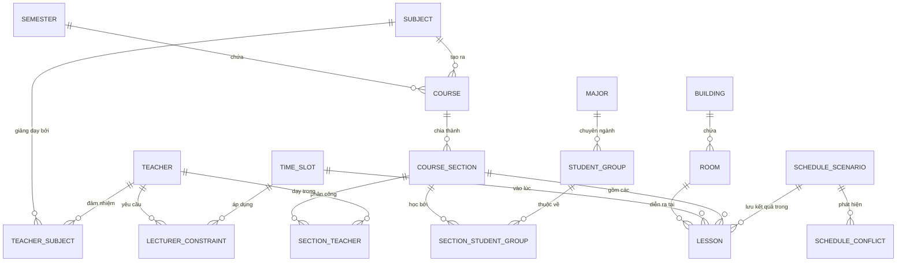

# Báo cáo Phân tích & Đánh giá Thiết kế Cơ sở Dữ liệu (Hệ thống Xếp lịch Học)

Tài liệu này được thực hiện bởi chuyên gia Phân tích Thiết kế Hệ thống (System Analyst) nhằm đánh giá cấu trúc cơ sở dữ liệu hiện tại (dựa trên tài liệu đặc tả API `swagger.json` và luồng nghiệp vụ xếp lịch biểu), chỉ ra các thiếu sót nghiêm trọng, và đề xuất giải pháp cải tiến tối ưu.

---

## 1. Phân Tích Hiện Trạng & Các Thiếu Sót Nghiêm Trọng

Qua phân tích các thực thể hiện tại trong `swagger.json` (`ScheduleDto`, `LessonDto`, `CourseSectionDto`, `CourseDto`, `SubjectDto`, `TeacherDto`, `RoomDto`, `StudentGroupDto`), hệ thống đang gặp phải các vấn đề thiết kế sau:

### 1.1. Vi phạm các quy chuẩn thiết kế CSDL (Normalization Violations)
*   **Dữ liệu trùng lặp và dư thừa trong `Lesson`:** 
    Bảng/Thực thể `Lesson` (Tiết học cụ thể) hiện tại chứa các trường: `subjectId`, `teacherId`, `studentGroupId`, `requiredRoomType`, `deliveryMode`. 
    *   *Lý do sai:* Tất cả các thông tin này đã được định nghĩa tại `CourseSection` (Lớp học phần) và `Course` (Học phần).
    *   *Hậu quả:* Vi phạm dạng chuẩn 3 (3NF). Nếu đổi giảng viên dạy lớp học phần, hệ thống phải cập nhật thủ công toàn bộ các `Lesson` tương ứng. Điều này dễ dẫn đến bất đồng bộ dữ liệu (Update Anomalies) và phình to dung lượng DB không cần thiết.
*   **Sự chồng chéo giữa `Subject` và `Course`:**
    Hệ thống tồn tại song song cả `SubjectDto` (Môn học) và `CourseDto` (Học phần) nhưng cả hai đều có `name` và `requiredRoomType`. 
    *   *Đúng chuẩn:* `Subject` là môn học gốc trong khung chương trình (ví dụ: Toán cao cấp - 3 tín chỉ). `Course` là một học phần được mở trong học kỳ cụ thể dựa trên `Subject` đó (ví dụ: Toán cao cấp - Học kỳ 1 năm học 2025-2026). Thiết kế hiện tại đang nhập nhằng hai khái niệm này.

### 1.2. Mâu thuẫn logic dữ liệu (Logical Contradictions)
*   **Mâu thuẫn Quan hệ Giảng viên & Nhóm sinh viên:**
    *   Trong `CourseSectionDto`, quan hệ là **1-N** hoặc **N-N** (`studentGroupIds` là một mảng, và `sectionTeachers` là danh sách các giảng viên cùng tham gia dạy lớp đó).
    *   Tuy nhiên, trong `LessonDto`, hệ thống lại giới hạn chỉ có **một** `teacherId` và **một** `studentGroupId` duy nhất.
    *   *Hậu quả:* Nếu một Lớp học phần được ghép từ 2 Nhóm sinh viên (`studentGroupIds: [1, 2]`), hoặc có 2 giảng viên (1 dạy lý thuyết, 1 phụ tá bài tập), thực thể `Lesson` hiện tại hoàn toàn bất lực không thể biểu diễn chính xác cấu trúc này mà phải tách thành các lesson độc lập giả lập, gây nhiễu thuật toán xếp lịch.

### 1.3. Lưu trữ cấu trúc mảng/danh sách trực tiếp trong cột (Array Storage Anti-pattern)
*   **Trường `studentGroupIds` trong `CourseSectionDto`:** Lưu trữ dưới dạng mảng số nguyên (`int[]`).
*   **Trường `affectedEntityIds` trong `ScheduleConflictDto`:** Lưu trữ mảng ID các thực thể chịu ảnh hưởng.
*   *Lý do sai:* Đây là mô hình cơ sở dữ liệu quan hệ (RDBMS). Việc lưu trữ mảng trực tiếp vào cột khiến việc thiết lập khóa ngoại (Foreign Keys) là bất khả thi, không thể tạo Index để tối ưu truy vấn, và gây khó khăn lớn khi viết các câu lệnh SQL JOIN.
*   *Hậu quả:* Không thể đảm bảo tính toàn vẹn tham chiếu (Referential Integrity). Nếu xóa một `StudentGroup`, cơ sở dữ liệu không tự động kiểm tra hay xóa được trong mảng `studentGroupIds` của `CourseSection`.

### 1.4. Thiếu hụt các ràng buộc thực tế trong nghiệp vụ giáo dục
*   **Thiếu thông tin Địa điểm vật lý (Building & Floor):**
    `RoomDto` chỉ có `name`, `capacity`, `roomType`. Trong thực tế giảng đường đại học, việc di chuyển giữa các tòa nhà (Building) hoặc các tầng (Floor) khác nhau của giảng viên/sinh viên giữa 2 tiết học liền kề là một ràng buộc rất lớn. Nếu xếp tiết 1 ở Tòa A tầng 5, tiết 2 ở Tòa B tầng 4, giảng viên và sinh viên sẽ không kịp di chuyển.
*   **Thiếu hồ sơ giảng dạy giảng viên (Lecturer Competency):**
    Hiện không có bảng liên kết giữa Giảng viên và Môn học họ có thể dạy (`TeacherSubject`). Hệ thống xếp lịch tự động có thể vô tình phân công một giáo viên chuyên ngành CNTT đi dạy môn Triết học nếu chỉ dựa trên thời gian rảnh.
*   **Thiếu chi tiết trang thiết bị phòng học:**
    `roomType` chỉ phân biệt Lý thuyết (0) và Thực hành (1) là quá sơ sài. Phòng thực hành máy tính (IT Lab) khác hoàn toàn phòng thí nghiệm Hóa học hay phòng Lab ngoại ngữ. Cần có bảng thuộc tính thiết bị phòng học.
*   **Thiếu cơ chế quản lý Học kỳ & Năm học (Academic Semesters):**
    Thiếu bảng `Semester` và `AcademicYear`. Toàn bộ lịch học (`Schedule`) đang được xử lý như một kịch bản cô lập mà không gắn liền với niên giám lịch sử của nhà trường.
*   **Thiếu Lịch sử & Nhật ký Thay đổi (Audit Logs):**
    Xếp lịch biểu là một quá trình tương tác liên tục giữa thuật toán tự động và điều chỉnh thủ công bằng kéo thả (Drag-and-Drop). Việc thiếu các trường/bảng lưu vết như `updatedBy`, `updatedAt`, `changeLog` khiến việc quản lý phiên bản lịch bị chồng chéo.

---

## 2. Đề Xuất Sơ Đồ Cơ Sở Dữ Liệu Cải Tiến (RDBMS)

Dưới đây là thiết kế cơ sở dữ liệu quan hệ cải tiến đạt chuẩn hóa **3NF**, giải quyết triệt để các vấn đề trên và hỗ trợ tối đa cho thuật toán xếp lịch biểu (Solver).

### 2.1. Sơ đồ Quan hệ Thực thể (ERD - Mermaid Diagram)

---

### 2.2. Chi tiết cấu trúc các bảng đề xuất

#### Nhóm 1: Danh mục gốc (Master Data)

##### 1. Bảng `Subject` (Môn học)
Lưu trữ danh mục môn học chung của trường.
*   `id` (PK, int, Auto Increment)
*   `subject_code` (varchar(20), Unique) - Ví dụ: `INT1301`
*   `name` (nvarchar(100)) - Ví dụ: `Cơ sở dữ liệu`
*   `credits` (int) - Số tín chỉ
*   `required_room_type` (int) - 0: Lý thuyết, 1: Thực hành máy tính, 2: Phòng Thí nghiệm...

##### 2. Bảng `Teacher` (Giảng viên)
*   `id` (PK, int, Auto Increment)
*   `teacher_code` (varchar(20), Unique) - Ví dụ: `GV0012`
*   `name` (nvarchar(100))
*   `email` (varchar(100))
*   `phone` (varchar(15))
*   `teacher_type` (int) - 0: Cơ hữu, 1: Thỉnh giảng
*   `max_slots_per_week` (int) - Số tiết tối đa có thể dạy trong tuần
*   `department_id` (int, FK) - Liên kết tới khoa/bộ môn

##### 3. Bảng `TeacherSubject` (Năng lực Giảng dạy - Mới)
Giải quyết bài toán phân công đúng chuyên môn.
*   `teacher_id` (PK, FK, int)
*   `subject_id` (PK, FK, int)

##### 4. Bảng `Building` (Tòa nhà - Mới) & `Room` (Phòng học)
*   **Bảng `Building`**:
    *   `id` (PK, int)
    *   `name` (nvarchar(50)) - Ví dụ: `Tòa nhà A1`
    *   `location_coordinates` (varchar(50), Nullable) - Dùng để tính toán khoảng cách nếu cần
*   **Bảng `Room`**:
    *   `id` (PK, int)
    *   `building_id` (FK, int)
    *   `floor` (int) - Tầng (dùng để phạt điểm di chuyển quá xa)
    *   `name` (nvarchar(50)) - Ví dụ: `Phòng 402`
    *   `capacity` (int) - Sức chứa sinh viên
    *   `room_type` (int) - Loại phòng

##### 5. Bảng `StudentGroup` (Nhóm sinh viên / Lớp hành chính)
*   `id` (PK, int)
*   `name` (varchar(50)) - Ví dụ: `D19CNPM1`
*   `size` (int) - Sĩ số
*   `major_id` (FK, int)
*   `academic_year` (varchar(10)) - Khóa học (Ví dụ: `2022-2026`)

##### 6. Bảng `TimeSlot` (Kíp học cố định)
*   `id` (PK, int)
*   `day_of_week` (int) - 0: Chủ Nhật, 1-6: Thứ 2 đến Thứ 7
*   `slot_number` (int) - Tiết học thứ mấy trong ngày (kíp 1, kíp 2,...)
*   `start_time` (time) - Giờ bắt đầu (Ví dụ: `07:00:00`)
*   `end_time` (time) - Giờ kết thúc (Ví dụ: `09:15:00`)
*   `shift` (int) - Ca học (0: Sáng, 1: Chiều, 2: Tối)

---

#### Nhóm 2: Kế hoạch mở lớp & Phân công (Planning & Assignment)

##### 7. Bảng `Course` (Học phần mở theo Kỳ)
*   `id` (PK, int)
*   `subject_id` (FK, int)
*   `semester_id` (int) - Học kỳ (Ví dụ: Kỳ 1 năm 2025-2026)
*   `course_type` (int) - 0: Bắt buộc, 1: Tự chọn
*   `sessions_per_week` (int) - Số buổi học trong 1 tuần
*   `delivery_mode` (int) - 0: Trực tiếp (Offline), 1: Trực tuyến (Online)

##### 8. Bảng `CourseSection` (Lớp học phần)
Lớp thực tế được sinh viên đăng ký để học.
*   `id` (PK, int)
*   `course_id` (FK, int)
*   `section_code` (varchar(30), Unique) - Ví dụ: `Cơ sở dữ liệu - Nhóm 01`
*   `status` (int) - Trạng thái (0: Chờ xếp lịch, 1: Đã xếp xong, 2: Bị hủy)

##### 9. Bảng `CourseSectionTeacher` (Bảng trung gian phân công Giảng viên)
Thay thế mảng `sectionTeachers` cũ, cho phép 1 lớp có nhiều giảng viên với vai trò khác nhau.
*   `course_section_id` (PK, FK, int)
*   `teacher_id` (PK, FK, int)
*   `role` (int) - 0: Giảng viên chính, 1: Trợ giảng (Assistant/Lab instructor)

##### 10. Bảng `CourseSectionStudentGroup` (Bảng trung gian ghép Lớp học phần - Nhóm sinh viên)
Thay thế mảng `studentGroupIds` cũ, hỗ trợ các lớp ghép học chung giảng đường lớn.
*   `course_section_id` (PK, FK, int)
*   `student_group_id` (PK, FK, int)

---

#### Nhóm 3: Kết quả xếp lịch & Ràng buộc (Scheduling & Results)

##### 11. Bảng `ScheduleScenario` (Kịch bản xếp lịch)
*   `id` (PK, varchar(50)) - UUID kịch bản xếp lịch
*   `name` (nvarchar(100)) - Ví dụ: `Phương án xếp lịch tối ưu Hè 2026`
*   `created_at` (datetime)
*   `created_by` (int) - ID người dùng tạo phương án
*   `status` (varchar(20)) - `Queued`, `Running`, `Completed`, `Failed`
*   `hard_score` (int)
*   `soft_score` (int)

##### 12. Bảng `Lesson` (Tiết học được xếp lịch - Chuẩn hóa tối đa)
*Bảng này đã loại bỏ hoàn toàn các trường dư thừa. Toàn bộ thông tin môn học, giảng viên, sinh viên được truy vấn thông qua các liên kết JOIN.*
*   `id` (PK, int, Auto Increment)
*   `scenario_id` (FK, varchar(50)) - Kịch bản lịch học tương ứng
*   `course_section_id` (FK, int) - Liên kết tới Lớp học phần
*   `room_id` (FK, int, Nullable) - Phòng học được xếp (Null nếu chưa xếp hoặc Online)
*   `time_slot_id` (FK, int, Nullable) - Khung giờ được xếp (Null nếu chưa xếp)
*   `session_index` (int) - Buổi thứ mấy trong tuần (đối với môn học nhiều buổi/tuần)
*   `session_duration` (int) - Thời lượng buổi học (số tiết học kéo dài, ví dụ: 2 kíp hoặc 3 tiết)
*   `is_pinned` (boolean) - Khóa cứng tiết học (không cho thuật toán tự động di chuyển)

##### 13. Bảng `ScheduleConflict` (Chi tiết xung đột lịch)
*   `id` (PK, int, Auto Increment)
*   `scenario_id` (FK, varchar(50))
*   `conflict_type` (int) - Phân loại theo Enum
*   `level` (int) - 0: Hard, 1: Warning, 2: Soft
*   `description` (nvarchar(500)) - Mô tả chi tiết lỗi tiếng Việt
*   `primary_lesson_id` (FK, int) - Lesson chính gây xung đột (để FE highlight trực tiếp)
*   `secondary_lesson_id` (FK, int, Nullable) - Lesson đồng phạm gây xung đột (nếu có)

##### 14. Bảng `LecturerConstraint` (Ràng buộc thời gian bận của Giảng viên)
*   `id` (PK, int, Auto Increment)
*   `teacher_id` (FK, int)
*   `time_slot_id` (FK, int)
*   `is_preferred` (boolean) - `true` (Thích dạy khung này), `false` (Bận/Không muốn dạy khung này)
*   `weight` (int) - Trọng số phạt nếu thuật toán vi phạm mong muốn của giảng viên

---

## 3. Lợi Ích Của Thiết Kế Cải Tiến Đối Với Hệ Thống

1.  **Đảm bảo tính toàn vẹn dữ liệu (Data Integrity):**
    *   Khi thông tin Giảng viên hoặc Phòng học thay đổi, bạn chỉ cần sửa ở 1 nơi duy nhất (`Teacher` hoặc `Room`). Lịch học (`Lesson`) tự động kế thừa mà không bị lỗi mâu thuẫn dữ liệu.
2.  **Tăng tốc độ truy vấn & Tối ưu hóa Database (Query Performance):**
    *   Các bảng quan hệ trung gian (`CourseSectionTeacher`, `CourseSectionStudentGroup`) thay thế cho các trường kiểu mảng (`int[]`). Điều này cho phép Database thiết lập các khóa ngoại, lập chỉ mục (Indexes) trên các khóa ngoại này giúp tăng tốc các câu lệnh JOIN lên gấp 10 - 100 lần khi dữ liệu trường phình to.
3.  **Tối ưu hóa Thuật toán Xếp lịch (Optimizer Friendly):**
    *   Dữ liệu đưa vào Solver sẽ gọn nhẹ hơn nhiều. Thay vì gửi toàn bộ thông tin lặp đi lặp lại của từng lesson, hệ thống chỉ cần gửi cấu trúc quan hệ gọn gàng.
    *   Solver dễ dàng tính toán các khoảng cách vật lý di chuyển nhờ cấu trúc tòa nhà (`Building`) và tầng học (`floor`).
4.  **Hỗ trợ đầy đủ nghiệp vụ giảng dạy thực tế:**
    *   Hỗ trợ lớp ghép (nhiều nhóm sinh viên chung 1 phòng).
    *   Hỗ trợ lớp giảng dạy song hành (team teaching - nhiều giáo viên phụ trách các buổi khác nhau của lớp học phần).
    *   Kiểm soát tốt tính năng phân công giảng dạy dựa trên chuyên môn của giảng viên (`TeacherSubject`).

---

*Tài liệu phân tích này đã được ghi nhận và lưu trữ trực tiếp vào hệ thống của bạn để tiện theo dõi và tích hợp vào giai đoạn nâng cấp Backend.*
