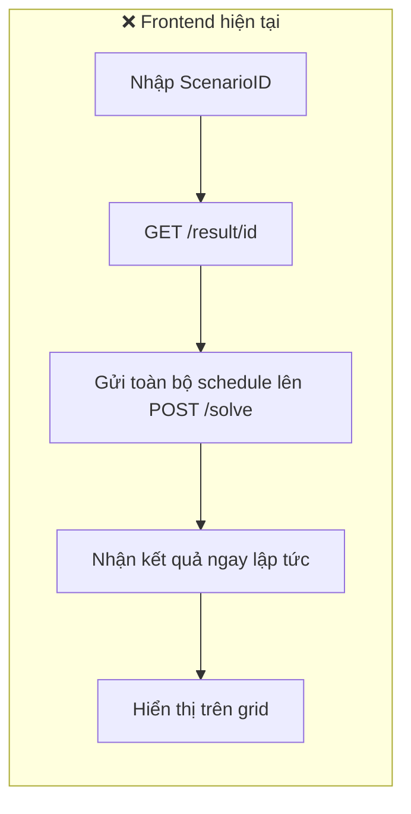
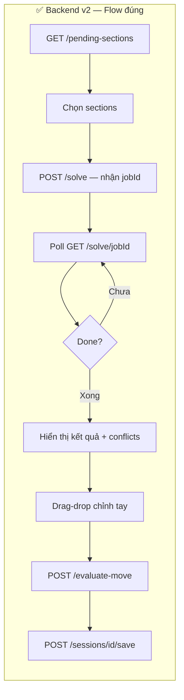

# Kế hoạch chi tiết cập nhật Frontend (Fe_Schedule)

## Tóm tắt vấn đề

Frontend hiện tại chạy workflow **cũ** (v1 — đồng bộ, gửi toàn bộ data lên `/solve`).
Backend đã chuyển sang workflow **mới** (v2 — bất đồng bộ, chỉ gửi `courseSectionIds` → poll jobId → xem kết quả trong memory → lưu DB).

> [!WARNING]
> **swagger.json** đi kèm FE đã lỗi thời hoàn toàn — thiếu 6 endpoints mới, `SolveScheduleRequest` contract sai, `LessonDto` thiếu 4 fields.

---

## So sánh Workflow Cũ vs Mới





---

## Kế hoạch 5 Phase

---

### Phase 1 — Nền tảng (Config + Enums + DTOs)
*Ước lượng: ~30 phút. Không ảnh hưởng UI.*

---

#### Bước 1.1 — Đổi API base URL

**File:** [api_config.jsx](file:///D:/Fe_Schedule/src/data/api/api_config.jsx)

```diff
-export const BASE_URL = "https://reporters-estates-authority-numerical.trycloudflare.com";
+export const BASE_URL = "http://localhost:5243";
```

---

#### Bước 1.2 — Bổ sung Enums mới

**File:** [enums.js](file:///D:/Fe_Schedule/src/constants/enums.js)

Thêm tất cả enums từ backend:

```js
// === Enums hiện có (giữ nguyên) ===
export const RoomType = { Theory: 0, Practice: 1 };
export const DeliveryMode = { Offline: 0, Online: 1 };

// === Enums MỚI ===
export const TeacherType = { Resident: 0, Guest: 1 };
export const CourseType = { Required: 0, Elective: 1 };
export const SolveStatus = { Queued: "Queued", Running: "Running", Completed: "Completed", Failed: "Failed" };

export const ConflictLevel = { Hard: 0, Soft: 1, Warning: 2 };
export const ConflictType = {
  GuestNoSlot: 0, RequiredNotPlaced: 1, ElectiveConflict: 2,
  StudentGroupOverload: 3, TimezoneViolation: 4,
  RequiredSingleSectionOverlap: 5, LunchBreakViolation: 6, RoomNotAssigned: 7
};

// Labels cho UI
export const TeacherTypeLabels = { 0: "Cơ hữu", 1: "Thỉnh giảng" };
export const CourseTypeLabels  = { 0: "Bắt buộc", 1: "Tự chọn" };
export const ConflictLevelLabels = { 0: "⛔ Nghiêm trọng", 1: "ℹ️ Gợi ý", 2: "⚠️ Cảnh báo" };
```

---

#### Bước 1.3 — Viết lại DTO request

**File:** [ScheduleScenarioRequest.js](file:///D:/Fe_Schedule/src/domain/DTO/ScheduleScenarioRequest.js)

Xóa toàn bộ nội dung cũ (`ScheduleScenarioRequest`, `ScheduleData`), thay bằng:

```js
/** POST /api/schedule/solve */
export class SolveRequest {
  constructor({ name = "New Schedule", courseSectionIds = [] } = {}) {
    this.name = name;
    this.courseSectionIds = courseSectionIds;
  }
}

/** POST /api/schedule/evaluate-move */
export class EvaluateMoveRequest {
  constructor({ sessionId, moves = [] } = {}) {
    this.sessionId = sessionId;
    this.moves = moves; // [{ lessonId, newTimeSlotId, newRoomId }]
  }
}

/** POST /api/schedule/hover-lesson */
export class LessonDetailRequest {
  constructor({ sessionId, lessonId } = {}) {
    this.sessionId = sessionId;
    this.lessonId = lessonId;
  }
}
```

---

### Phase 2 — Viết lại API Service Layer
*Ước lượng: ~45 phút. Thay thế toàn bộ `scheduleService.js`.*

---

#### Bước 2.1 — Rewrite `scheduleService.js`

**File:** [scheduleService.js](file:///D:/Fe_Schedule/src/services/scheduleService.js)

Xóa toàn bộ 203 dòng cũ. Viết mới **7 hàm** theo API v2:

| # | Hàm | Method | Endpoint | Mô tả |
|---|------|--------|----------|-------|
| 1 | `getPendingSections()` | GET | `/api/schedule/pending-sections` | Lấy danh sách sections chờ xếp |
| 2 | `solveSchedule(name, ids[])` | POST | `/api/schedule/solve` | Gửi yêu cầu solve, nhận `{ jobId }` |
| 3 | `pollSolveStatus(jobId)` | GET | `/api/schedule/solve/{jobId}` | Poll trạng thái: status, progress%, result |
| 4 | `getScheduleResult(scenarioId)` | GET | `/api/schedule/result/{scenarioId}` | Load lịch đã lưu từ DB |
| 5 | `evaluateMove(sessionId, moves)` | POST | `/api/schedule/evaluate-move` | Đánh giá drag-drop trước khi commit |
| 6 | `getLessonDetail(sessionId, lessonId)` | POST | `/api/schedule/hover-lesson` | Chi tiết lesson khi hover |
| 7 | `saveSession(sessionId)` | POST | `/api/schedule/sessions/{id}/save` | Lưu lịch từ memory vào DB |

**Xóa hoàn toàn:**
- `transformToApiFormat()` — 90 dòng client-side transform → không cần nữa
- `saveScenario()` — workflow cũ
- `normalizeScheduleResponse()` — format cũ

**Thêm helper:** `waitForSolveResult(jobId, onProgress)` — poll mỗi 3 giây, gọi `onProgress(pct)` mỗi lần, resolve khi `Completed`, reject khi `Failed`.

---

### Phase 3 — UI chính: Tách `SchedulingSystem.jsx` thành sub-components
*Ước lượng: ~2 giờ. Đây là thay đổi lớn nhất.*

---

#### Bước 3.1 — Tách `SectionPicker.jsx` [MỚI]

**File:** `D:\Fe_Schedule\src\presentation\UI\SectionPicker.jsx`

Thay thế ô input "Scenario ID" hiện tại bằng bảng chọn sections:

- Khi mount → gọi `getPendingSections()`
- Hiển thị bảng với cột: ☐ | Tên Môn | GV | Nhóm SV | Loại phòng | Mode
- Nút "Chọn tất cả" / "Bỏ chọn"
- Props: `onSectionsSelected(ids[])`, `disabled`
- Nếu API trả `items = []` → hiển thị "Tất cả đã được xếp lịch ✓"

> [!IMPORTANT]
> Nếu `/pending-sections` trả rỗng (tất cả sections đã có lịch), FE vẫn cho phép nhập `courseSectionIds` thủ công (1-52) để re-solve. Thêm toggle "Chọn thủ công".

---

#### Bước 3.2 — Tách `SolverProgress.jsx` [MỚI]

**File:** `D:\Fe_Schedule\src\presentation\UI\SolverProgress.jsx`

Hiển thị khi solver đang chạy (overlay trên grid):

- Progress bar: 0% → 20% → ... → 100%
- Phase label: "Đang khởi tạo..." → "Đang xếp lịch..." → "Hoàn tất"
- Spinner animation
- Props: `jobId`, `onCompleted(result)`, `onFailed(error)`
- Nội bộ: gọi `pollSolveStatus()` mỗi 3s, cập nhật progress

---

#### Bước 3.3 — Tách `ConflictPanel.jsx` [MỚI]

**File:** `D:\Fe_Schedule\src\presentation\UI\ConflictPanel.jsx`

Thay thế panel "📊 Thống kê" bên phải (hoặc bổ sung bên dưới nó):

- Nhận `conflicts[]` từ `schedule.conflicts`
- Nhóm theo `ConflictLevel`: Hard (đỏ) → Warning (vàng) → Soft (xanh)
- Mỗi item hiển thị:
  - Icon level + description (tiếng Việt, backend đã format sẵn)
  - `affectedEntityIds` → khi click → highlight lessons trên grid
- Badge đếm: "⛔ 3 | ⚠️ 1 | ℹ️ 2"
- Props: `conflicts[]`, `onHighlightLessons(ids[])`

---

#### Bước 3.4 — Sửa `SchedulingSystem.jsx` chính

**File:** [SchedulingSystem.jsx](file:///D:/Fe_Schedule/src/presentation/UI/SchedulingSystem.jsx)

**Thay đổi state:**
```diff
-const [scenarioId, setScenarioId] = useState("");
+const [sessionId, setSessionId] = useState(null);     // = jobId từ solve
+const [selectedSectionIds, setSelectedSectionIds] = useState([]);
+const [solveProgress, setSolveProgress] = useState(null); // { pct, phase }
+const [conflicts, setConflicts] = useState([]);
+const [highlightedIds, setHighlightedIds] = useState(new Set());
```

**Sửa `buildLessonsFromSchedule()`:**
```diff
 const buildLessonsFromSchedule = (schedule) => {
   const tMap = new Map((schedule.teachers || []).map((t) => [t.id, t]));
-  const sMap = new Map((schedule.subjects || []).map((s) => [s.id, s]));
+  const courseMap = new Map((schedule.courses || []).map((c) => [c.id, c]));
+  const sectionMap = new Map((schedule.courseSections || []).map((cs) => [cs.id, cs]));
   const gMap = new Map((schedule.studentGroups || []).map((g) => [g.id, g]));
   const tsMap = new Map((schedule.timeSlots || []).map((t) => [t.id, t]));

   return (schedule.lessons || []).map((lesson) => {
-    const teacher = tMap.get(lesson.teacherId);
-    const subject = sMap.get(lesson.subjectId);
+    const section = sectionMap.get(lesson.courseSectionId);
+    const course = section ? courseMap.get(section.courseId) : null;
+    // Lấy tất cả teachers cho section
+    const teachers = (section?.sectionTeachers || [])
+      .map(st => tMap.get(st.teacherId)?.name).filter(Boolean);
+    // Duration lấy trực tiếp từ API (không tính nữa)
+    const duration = lesson.sessionDuration || 2;
     ...
     return {
       id: String(lesson.id),
-      name: sn || `Mon ${lesson.subjectId}`,
+      name: course?.name || `Course ${lesson.subjectId}`,
-      teacher: tn || `GV ${lesson.teacherId}`,
+      teacher: teachers.join(", ") || `GV ${lesson.teacherId}`,
-      duration: ts ? getDurationFromTime(ts.startTime, ts.endTime) : 1,
+      duration,
+      sessionDuration: duration,
+      isPinned: lesson.isPinned,
+      courseSectionId: lesson.courseSectionId,
     };
   });
 };
```

**Sửa `handleSolve()`:**
```diff
 const handleSolve = async () => {
-  const result = await solveSchedule({ scenarioId, schedule: scheduleRaw, ... });
+  // Bước 1: Gửi solve request
+  const { jobId } = await solveSchedule("Lịch mới", selectedSectionIds);
+  setSessionId(jobId);
+
+  // Bước 2: Poll cho đến khi xong
+  const result = await waitForSolveResult(jobId, (pct, phase) => {
+    setSolveProgress({ pct, phase });
+  });
+
+  // Bước 3: Load kết quả
+  const schedule = result.schedule;
+  setScheduleRaw(schedule);
+  setLessons(buildLessonsFromSchedule(schedule));
+  setConflicts(schedule.conflicts || []);
+  setApiScore({ hard: result.hardScore, soft: result.softScore });
 };
```

**Thêm nút "Lưu lịch":**
```jsx
{sessionId && scheduleState !== "empty" && (
  <button className="schedv2-btn save" onClick={handleSave}>
    💾 Lưu lịch vào Database
  </button>
)}
```

**Sửa Drag-Drop (`onCellDrop`):**
```diff
 const onCellDrop = useCallback(async (e, slotKey) => {
   // ... parse slotKey → timeSlotId
+  if (sessionId) {
+    const evalResult = await evaluateMove(sessionId, [
+      { lessonId: Number(id), newTimeSlotId, newRoomId: null }
+    ]);
+    // Hiển thị popup: delta score, added/resolved conflicts
+    // Nếu user confirm → commit, else → revert
+  }
   setLessons((prev) => prev.map(...));
 }, [sessionId]);
```

**Multi-slot rendering trên grid:**

Lesson card với `sessionDuration > 1` cần chiếm nhiều hàng:
```jsx
<div className={`lesson-card ${variant} ${lesson.major}`}
     style={variant === "grid" && lesson.duration > 1
       ? { gridRow: `span ${lesson.duration}`, minHeight: `${lesson.duration * 60}px` }
       : {}}>
```

---

#### Bước 3.5 — Xóa code không còn dùng

Từ `SchedulingSystem.jsx`:
- Xóa `handleLoadMock()` — nút "Load mock" (mock data format cũ)
- Xóa `getDurationFromTime()` — tính duration từ time → dùng `sessionDuration` trực tiếp
- Xóa import `mockSchedule` — không dùng nữa

Từ `scheduleService.js`:
- Xóa `transformToApiFormat()` — 90 dòng
- Xóa `saveScenario()` — không dùng

---

### Phase 4 — CSS cho components mới
*Ước lượng: ~30 phút*

---

#### Bước 4.1 — Thêm styles vào `styles.css`

**File:** [styles.css](file:///D:/Fe_Schedule/src/styles.css) — append cuối file:

| Class | Mô tả |
|-------|-------|
| `.section-picker` | Bảng chọn sections (border, hover) |
| `.section-picker-row.selected` | Hàng đã chọn (highlight xanh) |
| `.solver-progress-overlay` | Overlay mờ + progress bar khi solve |
| `.progress-bar-animated` | Progress bar có animation |
| `.conflict-panel` | Panel conflicts bên phải |
| `.conflict-item.hard` | Nền đỏ nhạt, border trái đỏ |
| `.conflict-item.warning` | Nền vàng nhạt, border trái cam |
| `.conflict-item.soft` | Nền xanh nhạt, border trái xanh |
| `.conflict-badge` | Badge đếm "⛔ 3" |
| `.lesson-card.multi-slot` | Card chiếm nhiều rows |
| `.lesson-card.highlighted` | Glow effect khi click conflict |
| `.save-btn` | Nút "Lưu lịch" (gradient xanh, prominent) |
| `.evaluate-popup` | Popup đánh giá di chuyển |

---

### Phase 5 — Test & Mock data mới
*Ước lượng: ~30 phút*

---

#### Bước 5.1 — Cập nhật mock data (tùy chọn)

**File:** `D:\Fe_Schedule\src\data\mock_schedule.json`

Tạo mock mới từ API response thật (chạy solver 1 lần, copy JSON kết quả). Mock sẽ có format đúng v2:
```json
{
  "scenarioId": "mock-v2",
  "hardScore": -50000,
  "softScore": -5860,
  "schedule": {
    "teachers": [...],  // có teacherType, timezone, maxSlotsPerWeek
    "courses": [...],   // MỚI — có sessionsPerSession, courseType
    "courseSections": [...],  // MỚI — có sectionTeachers
    "conflicts": [...], // MỚI — description tiếng Việt
    "lessons": [...]    // có sessionDuration, courseSectionId, isPinned
  }
}
```

---

#### Bước 5.2 — Kiểm tra end-to-end

| # | Test Case | Kỳ vọng |
|---|-----------|---------|
| 1 | Login | Token lưu vào localStorage |
| 2 | Mở tab Scheduling | Bảng sections hiện từ API |
| 3 | Chọn 10 sections → nhấn "Xếp lịch" | Progress bar chạy → grid hiện kết quả |
| 4 | Panel conflicts | Hiện conflicts tiếng Việt, có icon level |
| 5 | Drag lesson sang slot khác | Popup evaluate-move hiện delta score |
| 6 | Nhấn "Lưu lịch" | API trả success, hiện thông báo |
| 7 | Lesson 3 tiết | Card chiếm 3 hàng liên tiếp trên grid |
| 8 | Hover lesson | Tooltip hiện multi-teacher, conflicts |

---

## Tóm tắt File Changes

| File | Action | Dòng thay đổi |
|------|--------|--------------|
| `src/data/api/api_config.jsx` | MODIFY | 1 dòng (URL) |
| `src/constants/enums.js` | MODIFY | +25 dòng |
| `src/domain/DTO/ScheduleScenarioRequest.js` | REWRITE | ~30 dòng |
| `src/services/scheduleService.js` | REWRITE | ~150 dòng (thay 203 dòng cũ) |
| `src/presentation/UI/SectionPicker.jsx` | NEW | ~120 dòng |
| `src/presentation/UI/SolverProgress.jsx` | NEW | ~80 dòng |
| `src/presentation/UI/ConflictPanel.jsx` | NEW | ~100 dòng |
| `src/presentation/UI/SchedulingSystem.jsx` | MODIFY | ~200 dòng thay đổi/xóa |
| `src/styles.css` | APPEND | ~150 dòng CSS mới |
| `src/data/mock_schedule.json` | REPLACE | Mock data v2 |

**Tổng ước lượng: ~4 giờ** chia thành 5 phases tuần tự.

---

## Thứ tự thực hiện đề xuất

```
Phase 1 (Config)     ─ 30 phút ─ Không break UI
    ↓
Phase 2 (API Layer)  ─ 45 phút ─ Compile OK nhưng UI chưa gọi
    ↓
Phase 3 (UI)         ─ 2 giờ   ─ Tạo sub-components + sửa SchedulingSystem
    ↓
Phase 4 (CSS)        ─ 30 phút ─ Styling cho components mới
    ↓
Phase 5 (Test)       ─ 30 phút ─ E2E test với backend đang chạy
```

> [!IMPORTANT]
> **Yêu cầu khi test**: Backend (`SortSchedule`) phải đang chạy trên `localhost:5243` với TabuSearch config nhanh (`MaxIterations: 500`). Nếu dùng config 5000 iterations, solve sẽ mất nhiều phút.

> [!NOTE]
> Các tab **Grade**, **User Management**, **Change Password** không bị ảnh hưởng — chỉ thay đổi tab **Scheduling** và service layer.
